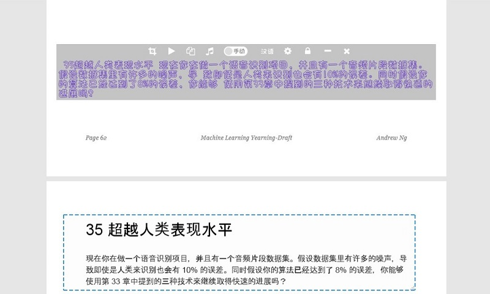
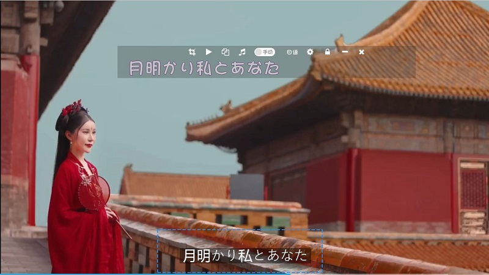
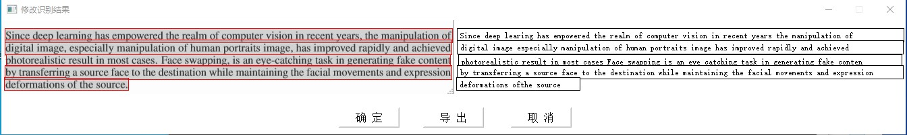

# Dango-OCR(Windows, Mac, Ubuntu)

#### 软件介绍:
DangoOCR：一个开源的文字识别工具,通过选择识别范围自动截取屏幕图片,或者手动加载本地图片实现文字的识别/提取。特点：
+ 界面简单,即下即用
+ 目前支持汉语, 日语, 英语, 韩语, 德语, 法语的文字识别, 会持续优化识别算法
+ 支持截图或者本地加载图片进行识别
+ 支持可视化识别结果,可以手动修正识别结果,并导出文件(.docx, .txt)及对应图片
+ 支持翻译为汉语
+ 如果开启“自动模式”, 选择一个区域后可以自动截屏并进行识别
+ 如果无法使用, 复制"config/error.txt"的内容进行反馈
+ 软件下载(存放目录路径中不能有空格)：
   ##### ~~服务器已到期,不再提供下载Windows版[下载](https://images-1302624744.cos.ap-beijing.myqcloud.com/software/DangoOCR_windows_v1.rar)
   ##### ~~服务器已到期,不再提供下载Mac版(只测了macOS 10.13.3)[下载](https://images-1302624744.cos.ap-beijing.myqcloud.com/software/DangoOCR_mac_v1.rar)
   ##### ~~服务器已到期,不再提供下载Ubuntu版(只测了ubuntu16.04)[下载](https://images-1302624744.cos.ap-beijing.myqcloud.com/software/DangoOCR_ubuntu_v1.rar)
   
#### OCR算法服务
+ 如果您对OCR算法不感兴趣, 可以直接使用上面已经做好的软件，解压后可以直接使用。如果您想进一步了解文字识别算法或者要自己搭建算法服务，可以参考[OCR算法服务](https://github.com/zhangming8/ocr_algo_server)进行部署并确保可以调通接口。在本工程中首先修改'config.py'中的ocr_request_url为搭好的服务地址，main.py是程序入口。
+ 相关说明1 [手把手教你用PaddleOCR与PyQT实现多语言文字识别的程序](https://mp.weixin.qq.com/s/MSSsTLrxPvxpl6ij7jIR-w)
+ 相关说明2 [使用飞桨一步步实现多语言OCR文字识别软件](https://blog.csdn.net/u010397980/article/details/111940566)

### TODO计划
+ 优化高分辨率屏幕文字较小
+ 导出docx文件时优化排版
+ 算法轻量化,实现离线文字识别

### 使用方法(以Windows系统为例)：

+ 1 解压压缩包后，找到“DangoOCR.exe”文件双击即可运行("Ubuntu"系统下也是双击。macOS系统下需要右键,打开方式选择终端)。在“设置”界面设置"待识别的语言类型"。

+ 2 软件界面如下(汉语识别)。

    

+ 3 如果在'设置'勾选了'可视化识别结果',可以对结果进行修改并可以导出为txt/docx。

    

+ 4 软件界面如下(日语识别)。

    

+ 5 识别英语文档并手动修改。

    

+ 6 算法debug

    

#### 参考：
+ OCR服务： https://github.com/zhangming8/ocr_algo_server
+ OCR算法参考百度PaddleOCR: https://github.com/PaddlePaddle/PaddleOCR
+ 界面代码参考 https://github.com/PantsuDango/Dango-Translator
